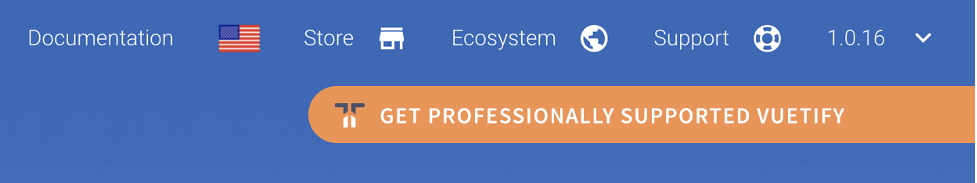
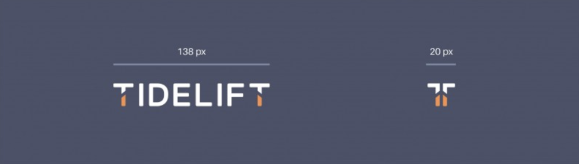
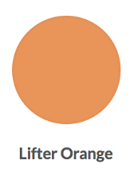
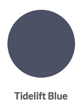
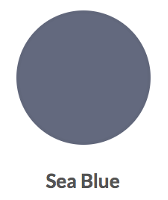

# Tidelift branding guidelines
If you have any questions or concerns, please notify us in the lifter slack community, or email support@tidelift.com. Let us know when you’ve added the Tidelift info to your site and readme, we’d love to see it!

## Samples  
[Here are some sample implementations](https://github.com/tidelift/lifter-stuff/tree/master/marketing-assets/sample-implementations)  
  

## Language  
Get professionally supported \<package name>  
Get \<package name> pro  

## README 
> \## Professionally supported <package name> is now available  
>  
> Tidelift gives software development teams a single source for purchasing and maintaining their software, with professional grade assurances from the experts who know it best, while seamlessly integrating with existing tools.

> \[Get supported \<package name> with the Tidelift subscription](\<appropriate marketing link here>)
  
  

# Logos 
The shorthand mark is the simplest symbol of the Tidelift brand. Use the shorthand mark if you are showing it in the context of other apps or if space is limited.  

Do not use the full Tidelift logo and the shorthand mark next to one another.  

## Primary shorthand mark
  
The Tidelift shorthand mark should primarily be used in its 2-color (orange and blue) format when the background color is white or a light color. If the background color is grey, use this logo variation if the background color uses less than 50% black.  
 
  
## Shorthand mark on dark background
  
When placing the shorthand mark on color, strive for maximum visibility. On dark backgrounds, use the 2-color (orange and white) logo. If the background color is grey, use this logo variation if the background color uses more than 50% black.
 

## Shorthand mark on bright background
 
When placing the shorthand mark on color, strive for maximum visibility. On bright backgrounds, use the 2-color (white and blue) logo.
 
 

## Primary logo
  
The Tidelift logo should primarily be used in its 2-color (orange and blue) format when the background color is white or a light color. If the background color is grey, use this logo variation if the background color uses less than 50% black. 

## Primary logo on dark background
  
When placing the logo on color, strive for maximum visibility. On dark backgrounds, use the 2-color (orange and white) logo. If the background color is grey, use this logo variation if the background color uses more than 50% black.

## Primary logo on bright background
  
When placing the logo on color, strive for maximum visibility. On bright backgrounds, use the 2-color (white and blue) logo.

# Logo clearspace and minimum size
When we place other design elements too close to the logo family it can sometimes suggest a relationship between them. Think of the logo family as our signature. The more we keep it intact, the more recognizable and valuable it will be. To maintain the integrity of the Tidelift identity, keep a fixed amount of open space around each logo to help it stand out.  
  
  
  
A minimum size ensures that the impact and legibility of the logo family is not compromised in application. Always maintain set proportions. Never show the logo smaller than 138x20 pixels 
and the shorthand mark smaller than 20x23 pixels.  
  
  

# Colors
Tidelift’s brand colors are designed to evoke a feeling of optimism. When paired together these colors reflect the brand’s focus on lifting. Lifter Orange is our main brand color. The other primary colors in the palette are considered accent colors that can be used interchangeably to create a vibrant backdrop against Tidelift's brand materials. Consider this palette the foundation or the starting point of our brand. 

## Lifter Orange | #F6914D
 

## Tidelift Blue | #4B5168
 

## Sea Blue | #626980
 

## Sea Blue | #2F3342
 
